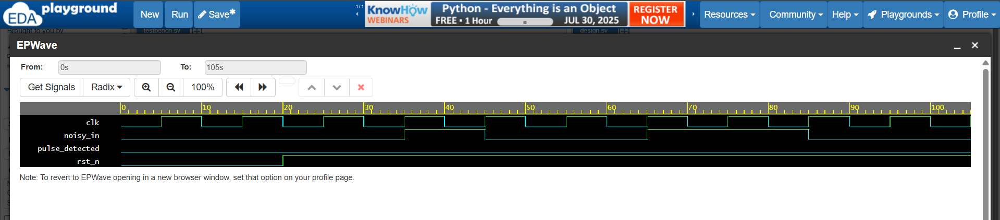

# Challenge 1: PulseTracer

### 1. Problem Description
Design a circuit detect a single-cycle high pulse from a noisy input stream. Ensure your design ignores short glitches and only reacts to a clean high transition.
### 2. Design Approach
- The circuit uses a two-stage shift register to sample the input on each rising clock edge, creating a 2-cycle history. 
- A combinational `assign` statement then checks for the `0-1-0` pattern across the current input and the stored history to detect a valid pulse.

### 3. Files
* `PulseTracer.v`: The Verilog design module.
* `tb_PulseTracer.v`: The testbench for verification.

### 4. Simulation Results
The design was verified using the provided testbench. Simulation confirms the logic correctly identifies single-cycle pulses while ignoring invalid inputs. All test cases passed.

