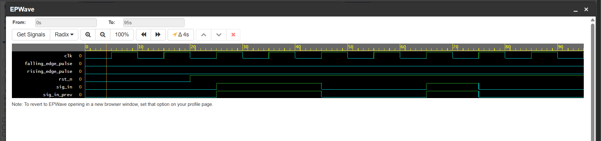

# Challenge 10: EdgeHighlighter

### 1. Problem Description
Detect rising and falling edges on an input signal and generate corresponding output pulses for each type of event.

### 2. Design Approach
- The design uses a single flip-flop to store the value of the input signal from the previous clock cycle. This stored value is then compared against the current input value to detect transitions.

- A **rising edge** is detected when the previous value was `0` and the current value is `1`. This condition is implemented in a single `assign` statement that drives the `rising_edge_pulse` output.
- A **falling edge** is detected when the previous value was `1` and the current value is `0`. This is implemented in a second `assign` statement for the `falling_edge_pulse` output.

The resulting outputs are single-cycle pulses that coincide with the detected edge.

### 3. Files
* `EdgeHighlighter.v`: The Verilog design module.
* `tb_EdgeHighlighter.v`: The testbench for verification.

### 4. Simulation Results
- The design was verified with a testbench that created various signal transitions.
- The simulation confirmed that a single-cycle pulse was generated on `rising_edge_pulse` only during a 0-to-1 transition, and on `falling_edge_pulse` only during a 1-to-0 transition.
- All test cases passed.

- 
