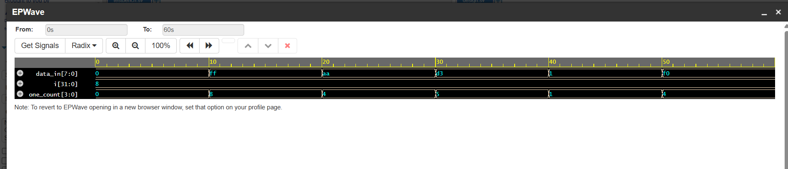

# Challenge 2: BitBalancer

### 1. Problem Description
Count the number of 1s in an 8-bit input value and output the total count. The count must reset correctly for each new input.

### 2. Design Approach
- The circuit is purely combinational, implemented with an `always @(*)` block. This ensures the output updates immediately whenever the input changes.
- A `for` loop iterates through each of the 8 bits of the input vector. A 4-bit register, `one_count`, is incremented for each bit that is a '1'.
- The counter is reset to zero at the beginning of every block execution, satisfying the requirement for the count to reset for each new input.

### 3. Files
* `BitBalancer.v`: The Verilog design module.
* `tb_BitBalancer.v`: The testbench for verification.

### 4. Simulation Results
- The design was verified with a testbench that provided several 8-bit values, including all zeros, all ones, and various mixed patterns.
- The `$monitor` system task confirmed that the `one_count` output was correct for every input vector. All test cases passed.

- 
