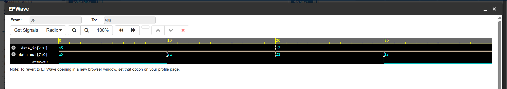

# Challenge 3: NibbleSwapper

### 1. Problem Description
Swap the upper 4 bits and lower 4 bits of an 8-bit input when a control signal is asserted. Maintain output stability when the control is deasserted.

### 2. Design Approach
- This module is implemented as a purely combinational circuit using a single `assign` statement with a ternary operator (`? :`).
- If the `swap_en` input is high, the output `data_out` is assigned the concatenated value of the input's lower nibble (`data_in[3:0]`) and upper nibble (`data_in[7:4]`). 
- If `swap_en` is low, the output is simply assigned the value of `data_in`, providing stable pass-through behavior.

### 3. Files
* `NibbleSwapper.v`: The Verilog design module.
* `tb_NibbleSwapper.v`: The testbench for verification.

### 4. Simulation Results
- The design was verified with a testbench that toggled the `swap_en` signal and changed the input data. 
- The simulation confirmed that the output nibbles are swapped only when `swap_en` is high and that the output correctly mirrors the input when `swap_en` is low. All test cases passed.
- 
