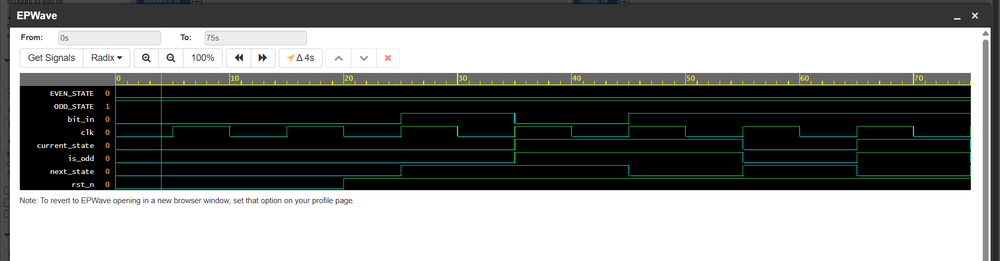

# Challenge 4: EvenOddFSM

### 1. Problem Description
- Implement a finite state machine that receives numbers and indicates if the current number is even or odd, while maintaining its state between inputs. 
- This was interpreted as an FSM that tracks the parity of a serial stream of bits.

### 2. Design Approach
The design is a two-state Moore-type Finite State Machine that checks for even or odd parity.
- **States**: `EVEN_STATE` and `ODD_STATE`. The FSM starts in `EVEN_STATE`.
- **Logic**: The FSM accepts a single bit input (`bit_in`) on each clock cycle. If the input is a `1`, the FSM transitions to the opposite state (EVEN -> ODD, ODD -> EVEN). If the input is a `0`, it remains in its current state.
- **Output**: The output `is_odd` is asserted high when the FSM is in the `ODD_STATE`, indicating that an odd number of `1`s have been observed since the last reset.

### 3. Files
* `EvenOddFSM.v`: The Verilog design module.
* `tb_EvenOddFSM.v`: The testbench for verification.

### 4. Simulation Results
- The testbench verified the FSM's behavior by applying a reset and then feeding it a sequence of bits. 
- The simulation confirmed that the FSM transitioned between states correctly and the `is_odd` output was asserted only when the cumulative count of `1`s was odd. All test cases passed.

- 
