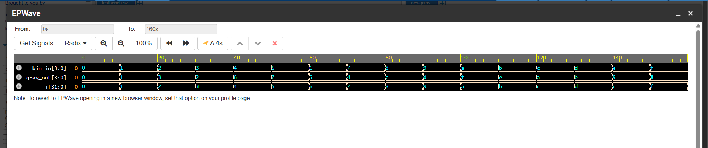

# Challenge 5: GrayCoder

### 1. Problem Description
Convert a 4-bit binary input to its Gray code equivalent. Output must update only when the input value changes.

### 2. Design Approach
- The design is a purely combinational circuit that implements the standard binary-to-Gray code conversion formula.
- A single `assign` statement is used. The 4-bit binary input `bin_in` is bitwise XORed with itself right-shifted by one place.
- This concise operation (`gray = binary ^ (binary >> 1)`) efficiently calculates the corresponding Gray code for any given binary input.

### 3. Files
* `GrayCoder.v`: The Verilog design module.
* `tb_GrayCoder.v`: The testbench for verification.

### 4. Simulation Results
- The design was verified with an exhaustive testbench that iterated through all 16 possible 4-bit values (from `0000` to `1111`). 
- The simulation log confirmed that the correct Gray code was generated for every input. All test cases passed.

- 
