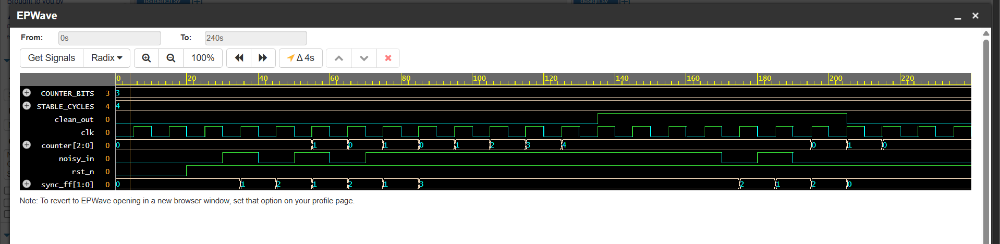

# Challenge 6: DebouncerLite

### 1. Problem Description
Build a simple debouncer that filters a noisy mechanical input and only passes a clean high signal after it has been stable for a few clock cycles.

### 2. Design Approach
This design uses a synchronous, counter-based approach to debounce the input.

-  **Synchronization**: The asynchronous `noisy_in` signal is first passed through a 2-flip-flop synchronizer to prevent metastability.
- **Counter Logic**: A counter increments on each clock cycle only if the synchronized input is stable high. If the input is low, the counter is reset to zero.
- The counter saturates (stops counting) when it reaches a `STABLE_CYCLES` threshold.
- Output Logic**: The `clean_out` signal is asserted high only when the counter reaches the `STABLE_CYCLES` value.
- It is de-asserted as soon as the input signal is detected as low, ensuring a sharp falling edge. This effectively filters out the rapid transitions (bounces) that occur when a mechanical button is pressed.

### 3. Files
* `DebouncerLite.v`: The Verilog design module.
* `tb_DebouncerLite.v`: The testbench for verification.

### 4. Simulation Results
- The testbench verified the circuit's behavior by simulating a noisy button press with several bounces.
- The simulation confirmed that the output remained low during the bounces and only asserted high after the input signal remained stable for the required number of cycles.
- The circuit also correctly handled a bouncing release. All test cases passed.

- 
