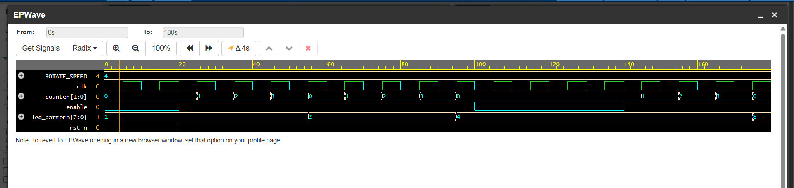

# Challenge 7: LightChaser

### 1. Problem Description
Create a rotating LED pattern (like a running light) that moves one bit to the left every few clock cycles. Provide reset and enable inputs.

### 2. Design Approach
The design consists of two main components working together within a single `always` block: a clock divider and a circular shift register.

- **Clock Divider**: A counter is used to generate a "tick" every `ROTATE_SPEED` clock cycles. This controls the speed of the rotation.
- **Circular Shift Register**: An 8-bit register `led_pattern` holds the current state of the lights. On reset, it's initialized to `8'b00000001`.
- **Control Logic**: When the `enable` input is high, the counter runs. When the counter reaches its maximum value, it triggers the `led_pattern` register to perform a single circular left shift. If `enable` is low, the counter and the pattern are frozen.

### 3. Files
* `LightChaser.v`: The Verilog design module.
* `tb_LightChaser.v`: The testbench for verification.

### 4. Simulation Results
- The design was verified with a testbench that asserted reset, enabled the rotation, disabled it to check if the pattern freezes, and then re-enabled it.
- The simulation confirmed that the pattern rotates at the correct speed and that the enable signal functions correctly to start and stop the rotation. All test cases passed.

- 
