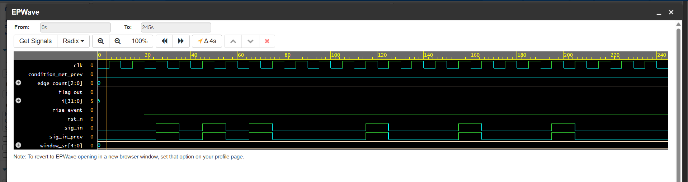

# Challenge 8: SeqCheck

### 1. Problem Description
Detect three rising edges on an input signal within a 5-cycle window. If detected, assert an output flag for one clock cycle.

### 2. Design Approach
The design uses a shift-register and counter to detect the specified sequence.
-  **Rising-Edge Detector**: A simple block detects a rising edge on `sig_in` and generates a single-cycle pulse, `rise_event`.
-  **Windowed Shift Register**: A 5-bit shift register, `window_sr`, captures the `rise_event` pulse on each clock cycle. This register effectively stores a history of rising edges over the last 5 cycles.
-  *Edge Counter**: A combinational `for` loop counts the number of set bits in `window_sr` to determine how many rising edges occurred within the window.
- **Output Logic**: To ensure the output `flag_out` is asserted for only one cycle, the logic detects the first moment the `edge_count` becomes 3 or more. It compares the current condition (`edge_count >= 3`) with the condition from the previous cycle, generating a single pulse only on the transition.

### 3. Files
* `SeqCheck.v`: The Verilog design module.
* `tb_SeqCheck.v`: The testbench for verification.

### 4. Simulation Results
- The testbench verified the circuit by generating sequences of rising edges.
- The simulation confirmed that `flag_out` is asserted for exactly one cycle when 3 edges occur within the 5-cycle window, and remains low for sequences where the edges are spaced too far apart.
- All test cases passed.

- 
