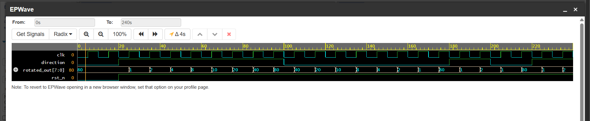

# Challenge 9: RotatorUnit

### 1. Problem Description
Implement a module that rotates an 8-bit value either left or right by one position on each clock cycle, based on a direction signal.

### 2. Design Approach
The module contains an 8-bit register, `rotated_out`, which holds the state of the pattern. On reset, this register is initialized to `8'b10000000`.

A single clocked `always` block manages the rotation. On each rising clock edge, it checks the `direction` input.
- If `direction` is `1`, it performs a circular left shift.
- If `direction` is `0`, it performs a circular right shift.

This implementation allows for continuous rotation and dynamic switching of the rotation direction.

### 3. Files
* `RotatorUnit.v`: The Verilog design module.
* `tb_RotatorUnit.v`: The testbench for verification.

### 4. Simulation Results
- The design was verified with a testbench that checked the reset state, continuous left rotation, continuous right rotation, and dynamically changing the direction.
- The simulation confirmed that the 8-bit pattern rotates correctly in the specified direction on each clock cycle. All test cases passed.

- 
